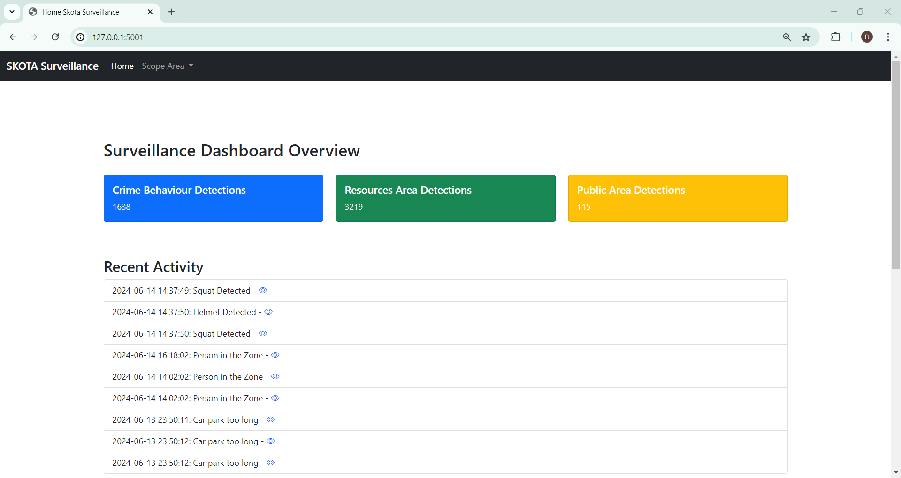
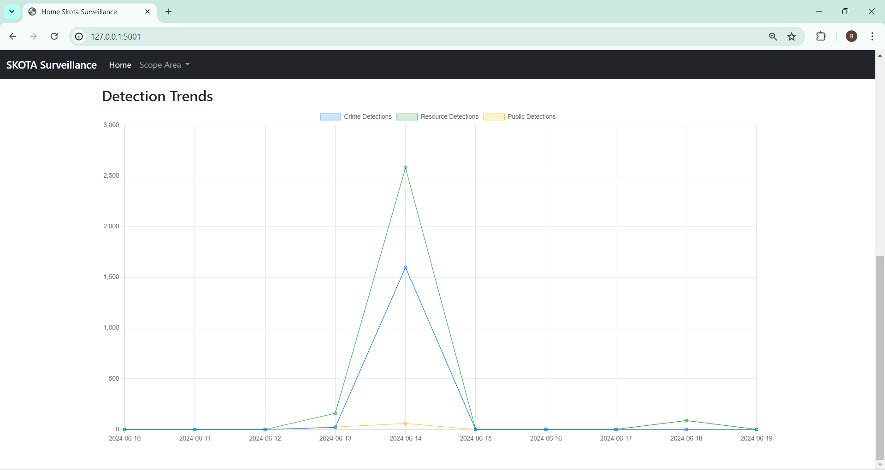
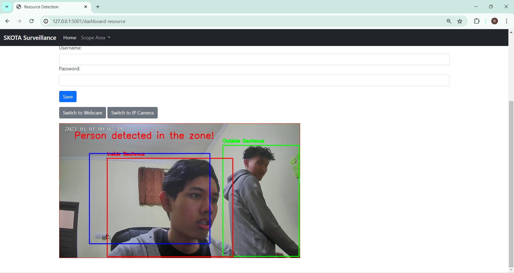
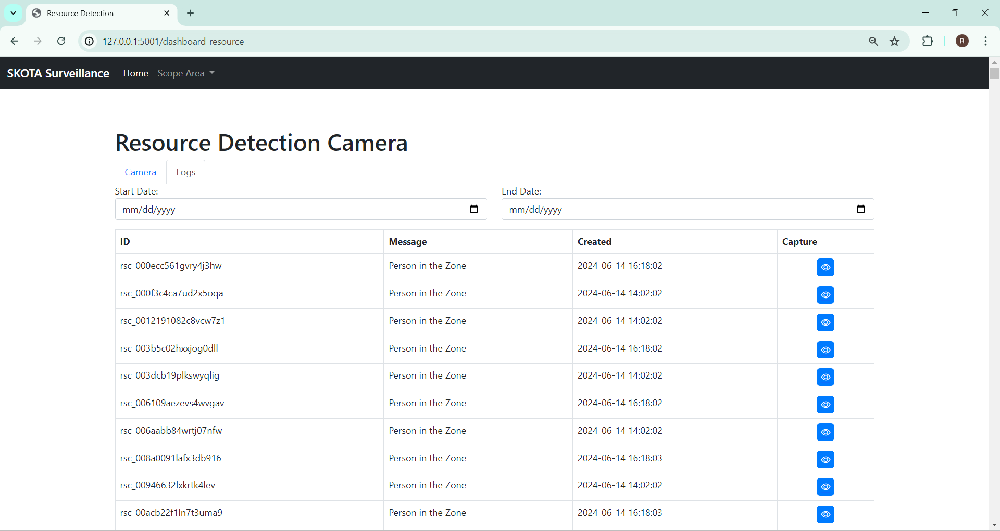

# Project Bangkit CCTV Surveillance
This repository contains the source code and documentation for our project aimed at enhancing surveillance management using AI technology for Surveillance Management.

### Description about project:
SKOTA by Lintasarta aids local public sectors in delivering superior Smart City services through comprehensive solutions that include planning, implementation, and community socialization.
A key component, Surveillance Management, is being enhanced to incorporate advanced AI functionalities for monitoring and analytics. The project involves deploying Agent DVR on PCs, providing tools like CCTV cameras, 
and integrating AI providers such as OpenAI, DeepStack AI, and CodeProject.AI. The scope includes detecting crime behaviors at ATMs, managing resources through smoke and fire detection, geofencing, and public area 
surveillance like people and car counting. Outputs will be summarized in a dashboard report for actionable insights. The project also aims to build proficiency in programming, AI technology integration, and web-based programming.

---

## Steps to Replicate

1. **Clone the Repository:**
    
    ```sh
    git clone https://gitlab.com/lintasartasolutions/AI/survilleance-cctv-ai.git
    cd survilleance-cctv-ai
    ```
    
2. **Setup Environment:**
    - Ensure you have Python 3.8 installed.
    - Set up a virtual environment (recommended)
        
        ```sh
        python -m venv venv
        source venv/bin/activate  # On Windows, use `venv\Scripts\activate`
        ```
        
    - Install dependencies:
        
        ```sh
        pip install -r requirements.txt
        ```

3. **Run the Application:**
    
    ```sh
    python app.py
    ```
    
    The application will start running locally. Access it at `http://127.0.0.1:5001`.
    
4. **Training and Running YOLOv8n Model:**
    - Follow instructions in `model/README.md` for setting up and training the YOLOv8n model using PyTorch.

5. **Accessing the Dashboard:**
    - Navigate to the dashboard at `http://127.0.0.1:5001/home` to view real-time surveillance data, analytics, and reports.

6. **Contributing and Development:**
    - Fork the repository, make changes, and submit pull requests for review.
    - Follow coding standards and document your changes thoroughly.

## Mockup
### Dashboard Views



### Dashboard Design


### Logs Design


## Additional Notes

- **Data Management:** Ensure proper handling and storage of surveillance data, adhering to data privacy and security regulations.
- **Deployment:** For production deployment, consider using Docker containers or a cloud platform like AWS or Azure.
- **Support:** For questions or issues, please contact our team at [contact@email.com].


---
## Project Timeline and Progress

### Document:
- [Timeline_Project_Capstone_Project](https://docs.google.com/spreadsheets/d/1gClWp3O0dwVf5K6_-nKF12SCQCPe9tpL4sn_hZkDBUk/edit?usp=sharing)
- [Project_Plan](https://docs.google.com/document/d/1PR1gY4Nd9L2OlB0L-LZSh77T6KLqymnjLnOGWZESN58/edit?usp=sharing)


### Progress:
Week 1 (6-12 May 2024)       : [Link_Presentation_Progress_Week1](https://drive.google.com/file/d/1_IkihP9XPxAZS209k_VZpMs9AiZjP29I/view?usp=sharing)

Week 2 (13-19 May 2024)      : [Link_Presentation_Progress_Week2](https://www.canva.com/design/DAGFTihi9JM/Ru3QYG42a6BeTnGJ7iDuLw/edit?utm_content=DAGFTihi9JM&utm_campaign=designshare&utm_medium=link2&utm_source=sharebutton)

Week 3 (20-26 May 2024)      : [Link_Presentation_Progress_Week3](https://drive.google.com/file/d/1N2KuLVsg7RPRF-2l4OWyxCnALW3AeFo1/view?usp=sharing)

Week 4 (27 May-2 June 2024)  : [Link_Presentation_Progress_Week4](https://drive.google.com/file/d/1XKJZ6U97bjggk8h375P6W392ANCJTQxX/view?usp=sharing)

Week 5 (3-9 June 2024)       : [Link_Presentation_Progress_Week5](https://drive.google.com/file/d/1PuEJzsWxhRJ6sNbhZ3HE8Ny8vTrZX-X9/view?usp=sharing)

Week 6 (10-16 June 2024)     : [Link_Presentation_Progress_Week6](https://drive.google.com/file/d/1PV6NnklNmXdC8hd1a1Y5b0INL_rnFN8q/view?usp=sharing)


